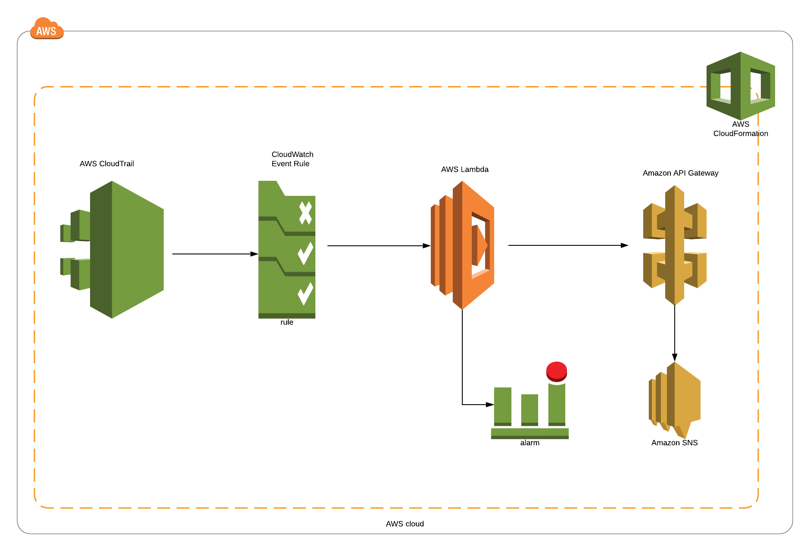

# apigateway-monitoring


* Automated CloudWatch alarms creation for ApiGateway resources via Lambda.



* We need to have an S3 bucket where we gonna upload the Lambda code.

* Use `CloudFormation` package command for uloading the lambda code to and S3 which will update the corresponding section of `CloudFromation` template as well.

```
aws cloudformation package --template-file cfn.yaml --s3-bucket bucket-name --output-template-file packaged-template.json
```

* Create the stack using below command

```
aws cloudformation create-stack --stack-name apigateway-monitorin --template-body file://packaged-template.json --region us-east-1 --capabilities CAPABILITY_IAM
```
